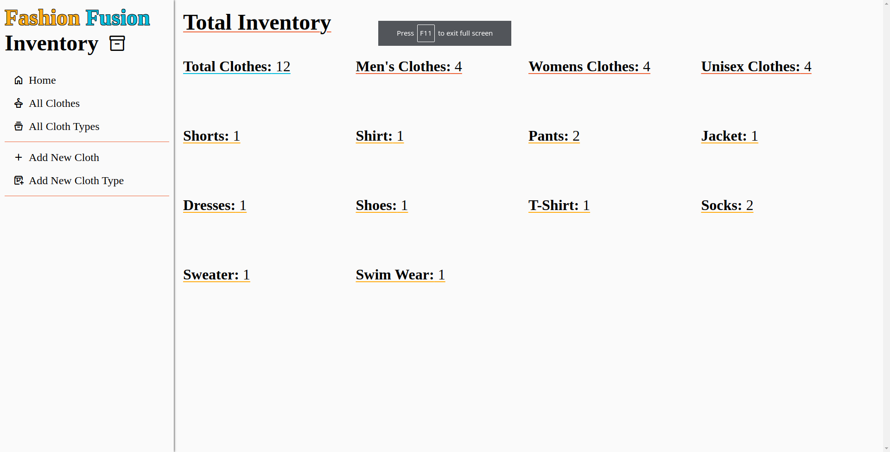
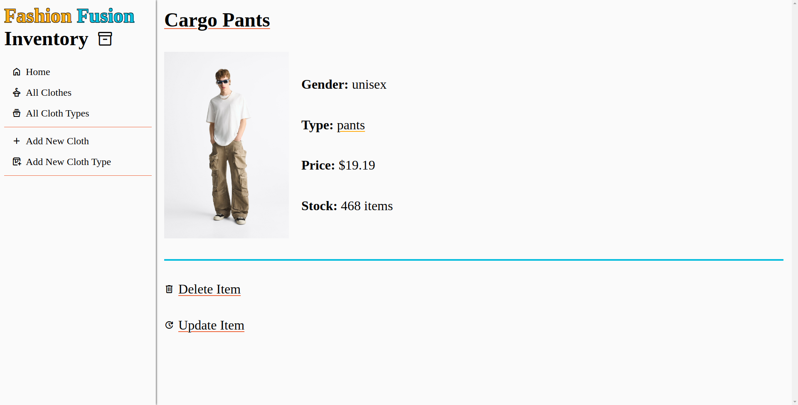
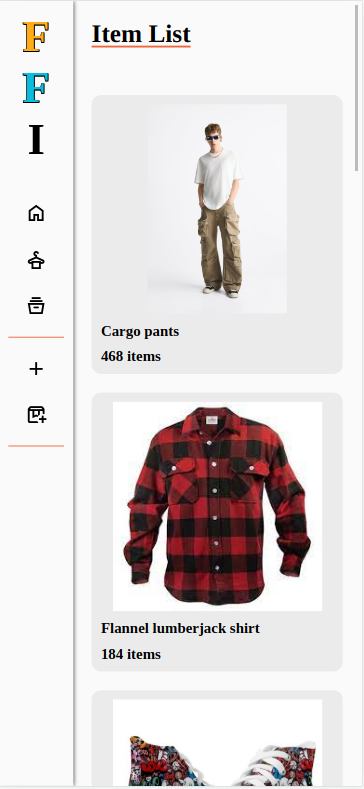

# Fashion Fusion Inventory

- An inventory app themed off of the fake store Fashion Fusion

Check out Fashion Fusion Here: [Fashion Fusion](https://babysparta.github.io/shopping-cart/) :point_left:

## Features

- Home page that shows the amount of each type of clothes that are in the inventory
- Clothes and cloth types list pages that show info about each respective category
- Ability to create new clothes and cloth types
- Ability to update and delete existing clothes and cloth types
- Destructive actions like updating and deleting are password protected
- Mobile compatability

## Build

- [Express](https://expressjs.com/)
- [Multer](https://www.npmjs.com/package/multer)
- [Mongoose](https://mongoosejs.com/docs/)
- [MongoDB](https://www.mongodb.com/)
- [Express-async-handler](https://www.npmjs.com/package/express-async-handler)
- [Pug](https://pugjs.org/api/getting-started.html)
- [Nodemon](https://www.npmjs.com/package/nodemon)

## Screenshots

